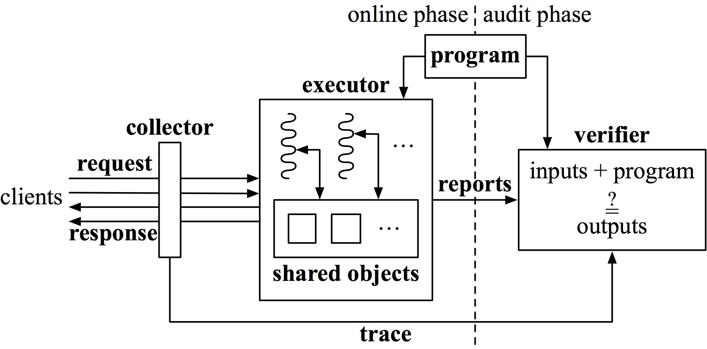

---
---

The Efficient Server Audit Problem
----------------------------------

A principal chooses or develops a program, and deploys
that program on a powerful but untrusted executor.

Clients (the outside world) issue requests (inputs) to the
executor, and receive responses (outputs). A response is supposed
to be the output of the program, when the corresponding
request is the input. But the executor is untrusted, so the
response could be anything.

A collector captures an ordered list, or trace, of requests
and responses. We assume that the collector does its job
accurately, meaning that the trace exactly records the requests
and the (possibly wrong) responses that actually flow into and
out of the executor.

The executor maintains reports whose purpose is to assist
an audit; like the responses, the reports are untrusted.

Periodically, the principal conducts an audit; we often refer
to the audit procedure as a verifier.
The verifier is much weaker than the executor,
so it cannot simply re-execute all of the requests.
The verifier gets a trace (from the accurate collector)
and reports (from the untrusted executor).

*How can the verifier determine whether executing
the program on each input in the trace truly produces the
respective output in the trace?*

Orochi: a built system
----------------------

Orochi is a research system to solve *The Efficient Server Audit Problem*
for PHP web applications.
Our high-level approach is to re-execute requests in the trace
in an accelerated way and compare the re-generated responses to
the responses in the trace.

There are two main challenges.
First, the verifier is much weaker than the executor,
so Orochi's re-execution must be cheaper than the original execution.
The second challenge arises from concurrency: the executor
is permitted to handle multiple requests at the same time (for
example, by assigning each to a separate thread). Hence,
given a trace, the number of valid possibilities for
the contents of responses could be immense.

Orochi (or its abstract solution) consists of three
key techniques to solve this problem.
* SIMD-on-demand execution
* Simulate-and-check
* Consistent ordering verification

Publication
-----------

**The Efficient Server Audit Problem, Deduplicated Re-execution, and the Web**  
Cheng Tan, Lingfan Yu, Joshua B. Leners, and Michael Walfish  
[SOSP 2017](https://www.sigops.org/sosp/sosp17/), Shanghai, China, October 2017.  
[[paper](doc/ssco-sosp17.pdf),
[extended version](https://arxiv.org/abs/1709.08501),
[slides](doc/cheng-sosp17-slides.pdf),
talk]

People
------

* [Cheng Tan](http://naizhengtan.github.io/)
* Lingfan Yu
* [Joshua B. Leners](http://josh.superlegit.biz/)
* [Michael Walfish](https://cs.nyu.edu/~mwalfish/)

Source code
-----------

Please find our [code](https://github.com/OrochiProject/orochi) on GitHub.
